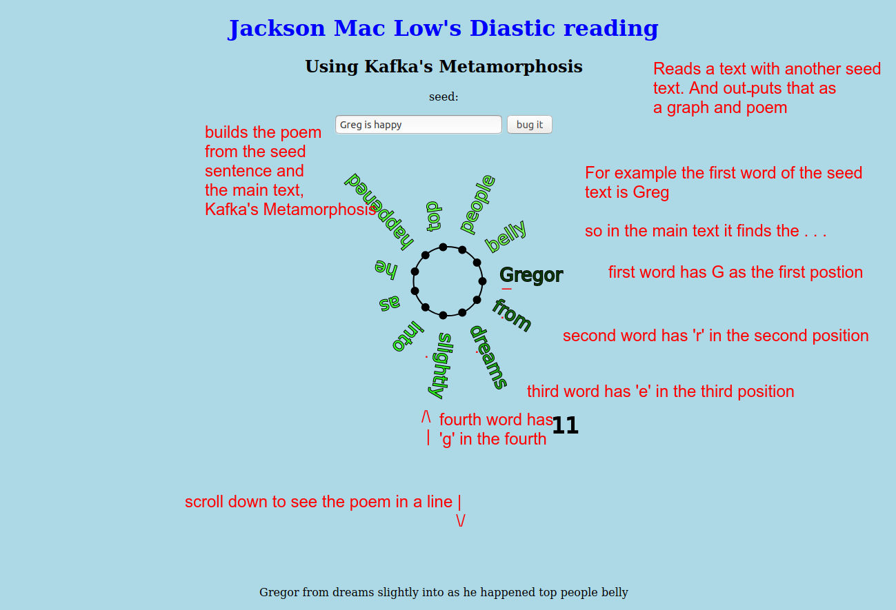

# diastic
A simple implementation of Mac Low diastic reading of Kafka's Metamorphosis in P5.js and Python

My code is inspired by Daniel Shiffman. The changes and errors I have made are my own;)

 Jackson Mac Low's Diastic. Following is an excerpted description of the process from Virtual Muse: Experiments In Computer Poetry (pgs. 95-96) by - Charles O. Hartman.

    The process began with a striking phrase from Virginia Woolf's The Waves: "ridiculous in Picadilly." 
    He reread the novel, looking for the first word that, like "ridiculous," began with an r; 
    then read the next word following that had (like "ridiculous") i as its second letter; 
    then the next whose third letter was d; 
    and so on until he had "spelled through" the whole phrase. 
    (There were other rules for line breaks, punctuation, and so on.) 
    The resulting text would be made entirely out of Woolf's words but would have none of the usual English syntax. 
 [Make a poem: click "bug it" on the seed text](https://editor.p5js.org/greggelong/present/Hy8jQ_bTh)

